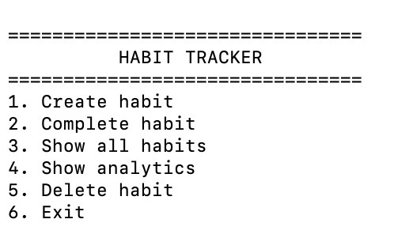
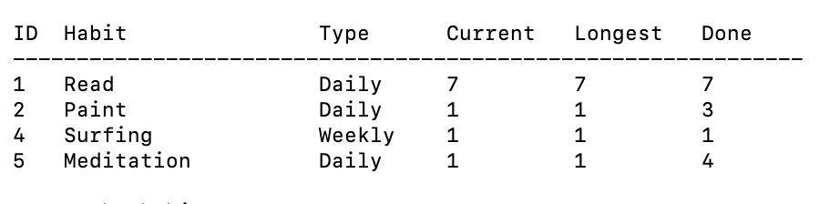
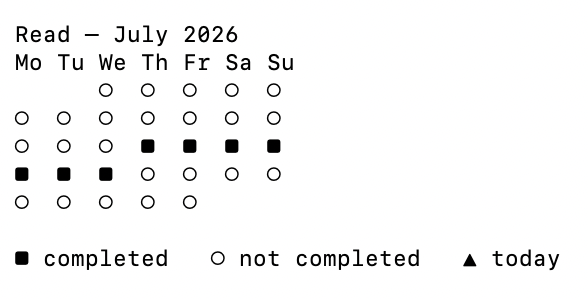

# Habit Tracker

A Python command-line application for tracking daily and weekly habits.

This project was developed as part of the **Object-Oriented and Functional Programming with Python** course at **IU International University of Applied Sciences**.

The application demonstrates object-oriented software design, functional programming principles, SQLite database persistence, and automated testing with pytest. Users can create habits, record completions, analyse streaks, and visualise monthly progress through an interactive command-line interface.

---

## Features

- Create daily and weekly habits
- Store habits persistently using SQLite
- Record habit completions
- Prevent duplicate completions within the same tracking period
- Display all tracked habits
- Filter habits by periodicity
- Calculate current streaks
- Calculate longest streaks
- Identify the habit with the longest streak
- Display monthly completion history
- Interactive command-line interface
- Comprehensive automated test suite (34 passing tests)

---

## Screenshots

### Main Menu

The application provides a simple command-line interface for creating habits, recording completions, viewing habits, and accessing analytics.



---

### Habit Overview

The overview displays all tracked habits together with their periodicity, current streak, longest streak, and total number of completions.



---

### Monthly Completion History

The completion history visualises a habit's progress throughout the month.

- ■ Completed
- ○ Not completed
- ▲ Today



---

## Project Structure

```text
habit-tracker/

├── app/
│   ├── __init__.py
│   ├── analytics.py
│   ├── cli.py
│   ├── database.py
│   ├── models.py
│   └── services.py
│
├── data/
│   └── habits.db
│
├── docs/
│   └── concept.md
│
├── screenshots/
│   ├── main-menu.png
│   ├── habit-overview.png
│   └── completion-history.png
│
├── tests/
│   ├── test_analytics.py
│   ├── test_cli.py
│   ├── test_database.py
│   ├── test_models.py
│   └── test_services.py
│
├── main.py
├── README.md
└── requirements.txt
```

---

## Technologies

- Python 3.12
- SQLite
- pytest
- Object-Oriented Programming (OOP)
- Functional Programming

---

## Architecture

The project follows a layered architecture to separate responsibilities between user interaction, business logic, persistence, and analytics.

```text
User
  │
  ▼
Command-Line Interface (CLI)
  │
  ▼
Service Layer
  │
  ▼
Repository
  │
  ▼
SQLite Database
```

Analytical functionality is implemented independently as pure functions.

```text
Habit Objects
      │
      ▼
Analytics Functions
      │
      ├── Current Streak
      ├── Longest Streak
      ├── Statistics
      └── Completion History
```

---

## Installation

Clone the repository.

```bash
git clone <repository-url>
cd habit-tracker
```

Create a virtual environment.

```bash
python3 -m venv .venv
```

Activate the environment.

### macOS / Linux

```bash
source .venv/bin/activate
```

### Windows

```powershell
.venv\Scripts\activate
```

Install the required packages.

```bash
pip install -r requirements.txt
```

---

## Running the Application

Start the Habit Tracker.

```bash
python main.py
```

---

## Running the Tests

Execute the automated test suite.

```bash
pytest -v
```

Expected result:

```text
========================
34 passed
========================
```

---

## Design Decisions

### Object-Oriented Programming

Habits are represented as objects that encapsulate their data and behaviour, providing a clear and extensible domain model.

### Functional Programming

Analytical operations such as filtering habits and calculating streaks are implemented as pure functions. These functions operate independently of the database and do not modify application state.

### Repository Pattern

Database operations are encapsulated in a repository layer. This separates persistence from business logic and simplifies future maintenance.

### Service Layer

The service layer coordinates communication between the command-line interface and the repository. The user interface never interacts directly with the database.

### SQLite

SQLite was chosen because it is lightweight, serverless, and fully integrated into Python, making it well suited for a standalone command-line application.

### Automated Testing

The application includes a comprehensive test suite covering the domain model, persistence layer, service layer, analytics, and command-line helper functions.

---

## Learning Outcomes

During this project I gained practical experience in:

- Object-oriented software design
- Functional programming techniques
- Layered software architecture
- SQLite database persistence
- Repository and service design patterns
- Automated testing with pytest
- Debugging and refactoring
- Command-line application development

---

## Future Improvements

Possible future extensions include:

- Coloured terminal output
- Editing existing habits
- Reminder notifications
- CSV export
- Graphical user interface (GUI)
- Cloud synchronisation
- Multiple user accounts

---

## Author

**Verena Uyka**

IU International University of Applied Sciences

Course: **Object-Oriented and Functional Programming with Python**